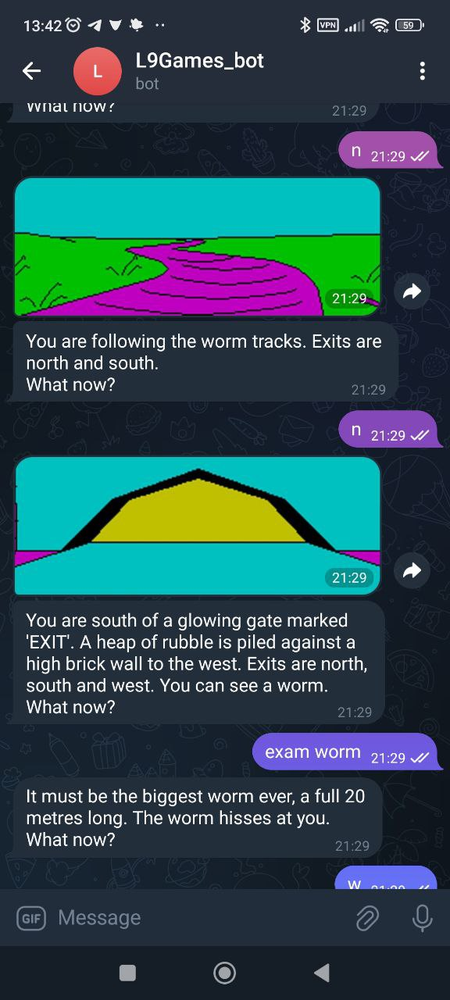

# L9 Games Telegram Bot

https://t.me/L9Games_bot - to try when it's running (but no save ingame progress between bot restarts yet!)

## Screen from Android device with Telegram:

Local Run:
 - mvn clear install spring-boot:run
 - environments: botToken=<botToken>;
       downloadsDir=tmp/downloads/; 
       gameDir=tmp/games/;
       l9source=<url/path_to_archive>;
       picturesDir/cache/
